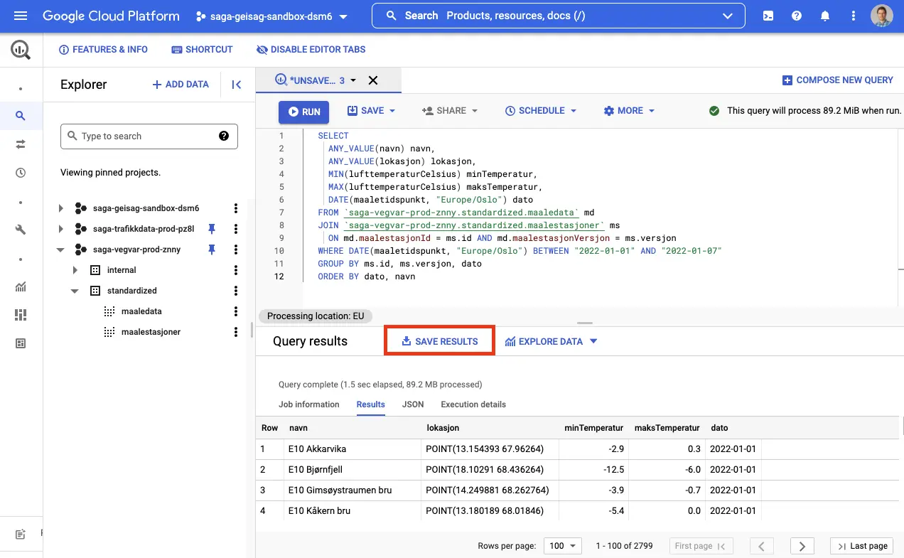
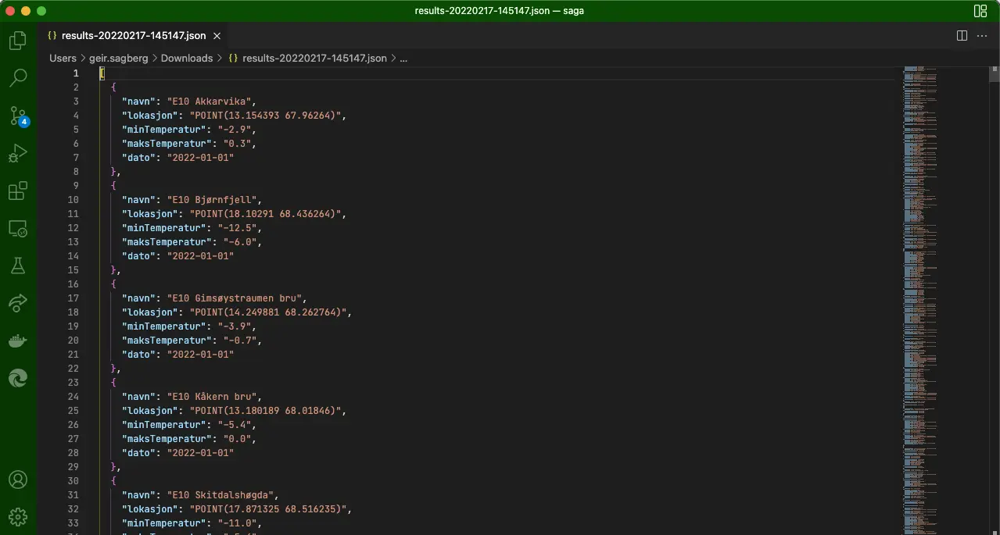

# Laste ned datasett og resultater

Det finnes mange måter å hente data ut fra BigQuery på. Her følger en forklaring på hvordan data kan eksporteres som JSON.

For å kunne eksportere data må du først ha opprettet en GCP-bruker og et prosjekt

1. Gå til [Målestasjoner-datasettet i BigQuery](https://console.cloud.google.com/bigquery?p=saga-vegvar-prod-znny&d=standardized&t=maalestasjoner&page=table).

   Prosjektet i prosjektvelgeren skal være satt til ditt personlige prosjekt. Det gjør at du får lov å kjøre spørringer mot BigQuery.

2. Legg inn følgende spørring:

   ```sql
   SELECT
     ANY_VALUE(navn) navn,
     ANY_VALUE(lokasjon) lokasjon,
     MIN(lufttemperaturCelsius) minTemperatur,
     MAX(lufttemperaturCelsius) maksTemperatur,
     DATE(maaletidspunkt, "Europe/Oslo") dato
   FROM `saga-vegvar-prod-znny.standardized.maaledata` md
   JOIN `saga-vegvar-prod-znny.standardized.maalestasjoner` ms
     ON md.maalestasjonId = ms.id AND md.maalestasjonVersjon = ms.versjon
   WHERE DATE(maaletidspunkt, "Europe/Oslo") BETWEEN "2022-01-01" AND "2022-01-07"
   GROUP BY ms.id, ms.versjon, dato
   ORDER BY dato, navn
   ```

   Denne spørringen vil hente ut alle minimums- og maksimumstemperaturer mellom 1. og 7. januar 2022.

3. Kjør spørringen, og velg så **SAVE RESULTS.**

   

4. Du vil få spørsmål om ulike lagringsmuligheter. Velg f.eks. **JSON (local file).** Denne nedlastingen støtter opp til 16 000 rader.

   Deretter kan du åpne JSON-filen i et tekstredigeringsprogram, som f.eks. [Visual Studio Code](https://code.visualstudio.com/).

   

   Denne dataen kan prosesseres videre offline, f.eks. ved hjelp av verktøy som [jq](https://stedolan.github.io/jq/), eller lastes inn i et annet analyseprogram, som Excel, [Data Studio](https://datastudio.google.com/) eller [Power BI](https://powerbi.microsoft.com/).
