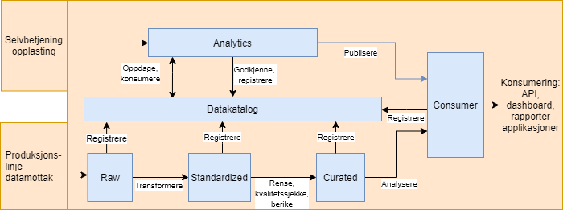

# Datasoner

Her følger informasjon om datasoner for data som deles på Saga.

Denne informasjonen er nyttig for team som skal bruke data fra Saga, og for de som skal publisere data dit.

## Hvorfor datasoner?

Vi ønsker at datasettene på dataplattformen skal deles inn i soner. Ulike soner har ulike krav til blant annet datakvalitet og kompletthet, og dermed vil en sone si noe om hva du kan forvente av datasettene den inneholder. Andre fordeler med soneinndeling er blant annet:

- Vi kan ha ulik tilgangsstyring på sonenivå.
- Det er lettere å finne datasett på det dataformatet du ønsker, fordi det inngår i definisjonene av en sone.
- Det bidrar til helhetlige datasett siden sonene legger føringer for ulike datatyper og dataformater et datasett må ha for å være en del av sonen.

## Soner, prosjekter og tilganger

I Google Cloud Platform (GCP) må alle ressurser, inkludert datalager, opprettes i et GCP-prosjekt. I tillegg er det slik at ulike typer data skal lagres i ulike datalagertjenester. Dermed vil ulike datasett tilsynelatende ligge spredt ut over ulike prosjekter og tjenester.

For å samle datasett på tvers av prosjekter og lagringstjenester har vi en [datakatalog](https://saga-datacatalog-prod-lszg.ew.r.appspot.com/). Her vil det finnes metadata om datasettene, blant annet hvilken datasone datesettet ligger i. Dette har vi for å hjelpe deg med å forstå hva du kan forvente av standardisering og datakvalitet i et datasett.

Generelt sett vil alle som har tilgang til et GCP-prosjekt kunne registrere sine datasett i ulike soner. Unntaket vil sannsynligvis være i `consumer`-sonen (forklares under), hvor vi på sikt ønsker en godkjenningsprosess for å sikre at datasettene er tilstrekkelig dokumentert. Den som registrerer et datasett i en sone kan sies å være "datasettets dataeier". Dataeier har ansvar for at datasettet tilfredsstiller føringer og krav som gjelder for en gitt sone.

## Soneinndelingen vi bruker

Datasonene vi ønsker å bruke er

- `raw`
- `standardized`
- `curated`
- `consumer`
- `analytics`.

### Raw

Her ligger ulike typer rådata som ikke har blitt prosessert. Dette er typisk ustrukturerte data og strukturerte data som ikke har den strukturen vi ønsker på plattformen. Data lagres så lenge som mulig, eller så lenge det kan være behov for data, slik at deriverte data kan regenereres for eksempel i forbindelse med feil eller endringer som krever det.

- Eksempel: bilder, video, XML, CSV, JSON
- Foreslått lager: Google Cloud Storage eller BigQuery.

### Standardized

I `Standardized` ligger data i en struktur med standardiserte datatyper. Data her har ikke vært gjennom særlig prosessering eller forretningslogikk utenom konvertering av datatyper og dataformat. Dataene i `standardized` gjør det enklere å utføre prosessering og analyse senere sammenlignet med det som ligger i `raw`.

Det er akseptabelt å ikke ta med alle felter fra datakilden dersom de åpenbart ikke er relevante eller dersom det medfører mye arbeid å få med alt. Data trenger ikke å lagres lenge siden de kan regenereres fra data i `raw`.

- Eksempel:
  - Fra gzippet XML til Avro-format
  - Fra UTM33 til WGS84-koordinater
  - Fra ulike datoformat til ISO8601 med tidssone
- Foreslått lager: BigQuery

> **Obs**: Dersom du er usikker på om konvertering av data begynner å nærme seg forretningslogikk, er det sannsynlig at
> dataene heller bør plasseres i `curated`.

### Curated

Her har dataene gjerne blitt forandret av forretningslogikk, og kan være sammenstilt fra flere kilder. Sonen filtrerer gjerne vekk flere datapunkter enn i tidligere steg, og data har blitt kvalitetssjekket. Data lagres så lenge som mulig, eller så lenge det kan være behov for, slik at deriverte data kan regenereres, for eksempel i forbindelse med feil eller endringer som krever det.

- Foreslått lager: Google Cloud Storage eller BigQuery.

### Consumer

Datasett som ligger i denne sonen er klar for at andre brukere av dataplattformen kan ta de i bruk. Data er godt beskrevet. Blant annet må du beskrive:

- Datakvalitet
- Datamodell
- Hvor dataene kommer fra

Kanskje vil det bli nødvendig å avgrense tilgangen til å plassere datasett i consumer for å sikre at det som ligger der tilfredsstiller krav til kvalitet og dokumentasjon. Data agres så lenge som mulig eller så lenge det kan være behov for data.

- Foreslått lager: Google Cloud Storage eller BigQuery.

## Typisk dataflyt

Figuren under illustrerer hvordan data transformeres og forflyttes på plattformen gjennom ulike soner. Figuren viser også hvordan datasett kan bli registrert i en datakatalog samt hvordan du via en selvbetjeningsløsning kan oppdage datasett og registrere egne datasett. Du kan også se at data i `consumer` tilgjengeliggjøres for andre via API og dashboard i tillegg til internt på plattformen.

## Nyttig å vite om datasoner

Det er ikke detaljert hvilken prosess du må gjennom for å registrere et datasett i `consumer`-sonen. For at datakatalogen skal plukke opp delte BigQuery-tabeller automatisk, må de ligge i et "BQ Dataset" med navn lik datasonen de tilhører. For eksempel vil veglenker fra NVDB ligge i datasone `Standardized`, slik at hele tabell-IDen inkludert prosjekt blir: `saga-nvdb-prod-vlmh.standardized.veglenker`. I tillegg må tabellen minst ha beskrevet et sett med metadata [som definert i vår Terraform-modul her](https://github.com/svvsaga/terraform-modules/tree/main/datacatalog_tags_dcat_egenskaper).
